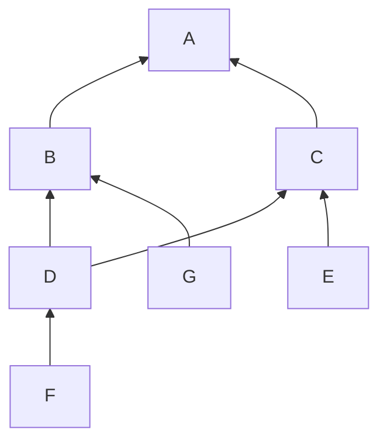

# Homework 8 - Spring 2023

* Vincent Lin
* [UID REDACTED]
* Section 1D


## Question 1


### Question 1a

We can model the inheritance relationships as a DAG:



The supertype relationships can then be found by simply traversing the subgraph
rooted at the class/interface we're interested in.

* Interface `A` has no supertypes.
* Interface `B` has a supertype of `A`.
* Interface `C` has a supertype of `A`.
* Class `D` has supertypes of `B`, `C`, and `A`.
* Class `E` has supertypes of `C` and `A`.
* Class `F` has supertypes of `D`, `B`, `C`, and `A`.
* Class `G` has supertypes of `B` and `A`.


### Question 1b

It would be able to take objects with types that are `B` or subtypes of `B`,
which are: `B`, `D`, `G`, `F`.


### Question 1c

No. `C` is a subtype of `A`, so `A` cannot be used in place of a parameter that
expects type `C`.  This makes sense because if we recall from the definition of
a subtype/supertype definition, `C` supports all the operations that `A` does
but possibly more. This means that the implementation of `bar` might call a
method that exists for `C` but not `A`, resulting in undefined behavior.  Thus,
parameter `a` in `bletch` should not be allowed to be passed into `bar`.


## Question 3

Inheritance is a mechanism where a class can derive from another class, giving
it access to its interface and/or implementation in its own definition without
having to rewrite that code.  Subtype polymorphism is a mechanism where a
subtype can be used anywhere its supertype(s) is expected and work identically.
Dynamic dispatch is a mechanism where when a method is called on a polymorphic
object, it is determined at runtime which version of that method to execute.

Dynamic dispatch is necessary *because* of inheritance and subtype polymorphism.
These allow objects to have multiple versions of a method whose choice often
cannot be resolved at compile time.  Dynamic dispatch, as its name implies, is
also strictly a runtime concept.  Conversely, subtype polymorphism checks for
type compatibility at compile time.  Subtype polymorphism also only makes sense
in statically typed languages.  On the other hand, inheritance and dynamic
dispatch apply to both statically and dynamically typed languages.


## Question 4

Subtype polymorphism doesn't work in a dynamically typed language because
variables don't have types.  Thus, it doesn't make sense to check if a variable
of a certain type can be used in place of a variable with another type.  Dynamic
dispatch can work in dynamically typed languages for a different reason.  Many
such languages support dynamically adding or removing methods that aren't part
of the original class definition from which the object was instantiated, so it
cannot be determined before runtime what a method call will result in.  The
solution to this is have every object maintain its own vtable, and since objects
are dynamic in nature, method lookup must occur at runtime.


## Question 5

This question is optional, but I used ChatGPT to see if I could understand the
answer (or what looks like one).  The prompt I used was the question itself.
Below is my paraphrased version of its answer.

Firstly, it claims that `ElectricVehicle` violates the **Dependency Inversion
Principle (DIP)** because it depends directly on `SuperCharger`, which is a
concrete implementation.  Instead, it should depend on an abstraction from which
`SuperCharger` derives such that `ElectricVehicle` is decoupled from the
specific implementation of a low-level module like `SuperCharger`, making the
code more resilient to change.  The solution would be to define an interface to
sit between `SuperCharger` and `ElectricVehicle`:

```cpp
// Full ABC that functions like an interface in C++.
class PowerProvider {
public:
    virtual void get_power() = 0;
    virtual double get_max_amps() const = 0;
    virtual double check_price_per_kwh() const = 0;
};

class SuperCharger : public PowerProvider {
public:
    void get_power() override { ... }
    double get_max_amps() const override { ... }
    double check_price_per_kwh() const override { ... }
};

class ElectricVehicle {
public:
    void charge(PowerProvider& pp) { ... }
};
```

Secondly, ChatGPT claims that the `SuperCharger` violates the **Single
Responsibility Principle (SRP)** because it's in charge of two distinct
responsibilities, power-related operations (`get_power` and `get_max_amps`) and
price-related operations (`check_price_per_kwh`).  I personally would argue that
all three are related closely enough to be included under one class, but if we
were to fix this problem, we would split `check_price_per_kwh` from our previous
`PowerProvider` interface off into its own interface and then have the concrete
class `SuperCharger` inherit from that too:

```cpp
class PowerProvider {
public:
    virtual void get_power() = 0;
    virtual double get_max_amps() const = 0;
};

class PriceChecker {
public:
    virtual double check_price_per_kwh() const = 0;
};

class SuperCharger : public PowerProvider, public PriceChecker {
public:
    void get_power() override { ... }
    double get_max_amps() const override { ... }
    double check_price_per_kwh() const override { ... }
};

class ElectricVehicle {
public:
    void charge(PowerProvider& pp) { ... }
};
```


## Question 6

I would argue that the **Liskov substitution principle (LSP)** still applies to
dynamically typed languages.  While the notion of subtype polymorphism doesn't
apply to them due to variables not having types, programmers are still
interested in the typing and implications of inheritance on the *values* they
operate with.  For example, to reuse the problem from [Question 5](#question-5),
we might model an `ElectricVehicle` with a class that has a `charge` method that
accepts some `PowerProvider` parameter:

```python
class ElectricVehicle:
    def charge(self, pp: PowerProvider) -> None:
        ...
```

While the language itself does not enforce `pp` to be a `PowerProvider` type,
the semantics of the code expect it to be.  This implies that any subtype of
`PowerProvider` defined elsewhere in the code should be allowed to be passed in
as `pp` and work in the expected way.
